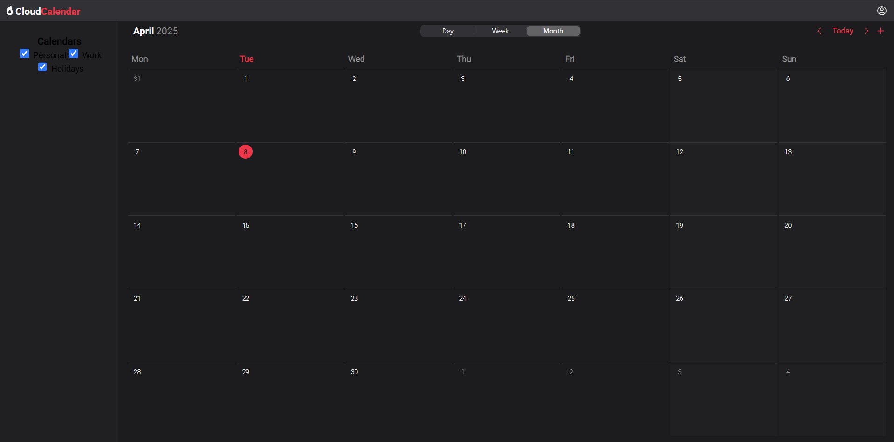
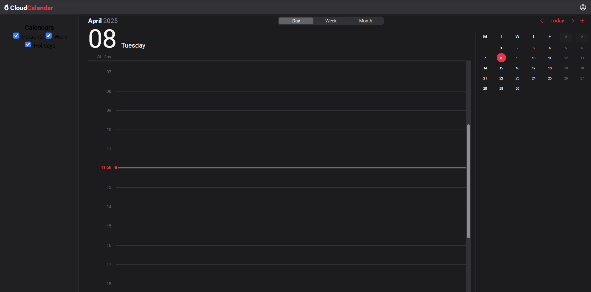
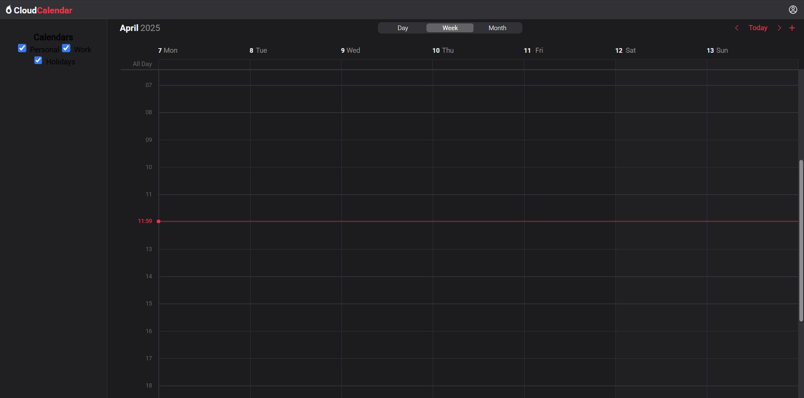

# Apple Calendar clone

> I started this project to remind myself and train my ReactJS and .NET skills by creating a clone of the task manager website. Of course some functions and buttons won't work or will be changed based on my requirements or project idea barrier (won't be able to transfer to other iCloud websites for examples).

## ReadMe stucture

1. [Project preview](#project-preview)
2. [Installation and testing](#installation-and-testing)
3. [Project plans](#project-plans)
4. [Programmer Diary](#developer-diary)

## Project preview

> Since the user will need to configure many things to run the project on another computer, I decided to add this section and show the work done in it upon completion of the next section of the path. After assembling the project, I think it will be possible to download it and fully test it, but now it is difficult to implement.

The first thing I would like to show is the completed options for displaying the calendar in the form of a month, week and day.





Also, at the moment, one type of interaction is already available - creating, logging in and logging out of an account.


## Installation and testing

*is not available now

## Project plans

### 01.04

- [x] Prepare basic models for the database
- [x] Write necessary controllers for the models
- [x] Test user profile creation functionality
- [ ] Test login and logout functionality for user profiles
- [x] Add code for user session management
- [ ] Test and debug session management functionality

### 02.04

- [x] {debug} Adding "Swagger" for testing API
- [x] {postponed} Test login and logout functionality for user profiles
- [x] {postponed} Test and debug session management functionality
- [x] Write interface code for header, userform, navigation and sidebar
- [ ] Write basic code for the calendar interface
- [ ] Create the first example of adding tasks to the calendar
- [ ] Create the first example of adding and displaying groups, grouping tasks into groups

### 03.04

- [x] {postponed} Write basic code for the calendar interface
- [x] Updating user form interface make it look more like icloud userform
- [x] Rewrite the code for calendar rendering from "Atrium" project
- [x] Connect navbar buttons with calendar
- [x] Write the calendar context for rendering control

### 04.04

- [x] Finish month version of the calendar and make it looks like iCloud as much as possible, *but only in a popup account container*
- [x] Plan and design the way of creating week and day versions of calendar
- [ ] Write new functions in api.js for basic events logic
- [ ] Test new api logic using Swagger

### 05.04

- [x] Write main structure for day calendar
- [x] Write basic styles for the day calendar
- [x] Create the scroll container for event chart

### 06.04

- [x] Restructuring the calendar functions and files for better code orientation
- [x] Upgrade scroll container part *except handling events*
- [x] Upgrade context controller to handle date changeing and smooth page refresh without losing selected view and date
- [x] Write full styles for day calendar *except events objects*
- [x] Write code for small month calendar grid in day calendar

### 07.04

- [x] Write the main structure for week calendar
- [x] Write basic styles for the week calendar

- [x] Write full sctucture for week calendar *except handling events*
- [x] Write full styles for week calendar *except events objects*
- [x] Analyse and plan the event adding pattern *firstly just with the navbar button*
- [ ] Write all code required for event popup element *firstly just with the navbar button*

### 08.04

- [x] Write new functions in event controller to handle all required operations
- [x] Write new api functions to support all required operations
- [x] {postponed} Write all code required for event popup element *firstly just with the navbar button*
- [ ] Write prototype logic for rendering events on month grids

### ToDo later

- [ ] {postponed} Create the first example of adding tasks to the calendar
- [ ] {postponed} Create the first example of adding and displaying groups, grouping tasks
- [ ] {postponed} Write new functions in api.js for basic events logic
- [ ] {postponed} Test new api logic using Swagger

## Developer Diary

> In this section, would just like to write down interesting areas of development and writing code for myself in the future.

### Day calendar

On the fourth day of development, having finished with the month version of calendar, I switched to the daily calendar. Since I have already interacted with databases, as well as with regular calendars, this is the first time in the project when I did something radically new and exciting. After studying the structure of this section on the Apple website, I started designing what needed to be implemented next.

``` html
    <div class="calendar-day-view">
        <div class="day-body">
            <div class="day-header">
                <h1>04</h1>
                <span>Friday</span>
            </div>
            <div class="evets-container"> 
                <div class="events-header"> // has massive devider line under it
                    <div class="all-day-line">
                        All day
                    </div>
                    <div class="all-day-events" />
                </div>

                <div class="scroll-container">
                    <div class="day-timline-chart" />
                    <div class="day-event-chart">
                        <div class="event-chart-background"/>
                        <div class="event-column-chart" />
                    <div/>
                    <div class="now-timeline" /> // vertical % translate
                </div>
            </div>
        </div>
        <div class="info-container">
            <div id="month-calendar-mini" />
            <hr />
            <div class="event-info" id="event-info"/>
        </div>
    </div>
```

### Week calendar

``` html
    <div> // flex
        <div class="week-header">
            <div class="header-container"> // grid
                <div class="time-col-offset" />
                <div class="week-days-container">
                    <div class="week-days-grid"> // grid
                        <div> // grid-area: 1 / i / 2 / i+1;
                            <div class="week-day-lable">
                                <div class="week-day-date">31</div>
                                <div class="week-day-name">Mon</div>
                            </div>
                        </div>
                        ....
                    </div>
                </div>
            </div>
        </div>

        <div class="all-day-week-line"> // flex
            <div class="right-side-barrier"/>
            <span class="all-day-lable"> All Day </span> //flex
            <div class="all-day-events-container">
                <div class="all-day-events-grid"> // grid
                    <div> // grid-area: 1 / i / 2 / i+1;
                        // button for events adding
                    </div>
                    ....
                </div>
            </div>
        </div> 

        <div class="scroll-container"> // scroll
            <div class=the-scroll> //flex
                <div class="day-timline-chart" />
                <div class="day-event-chart">
                    <div class="event-chart-background"/>
                    <div class="event-column-chart" />
                <div/>
                <div class="now-timeline" /> 
            </div>
        </div>
    </div>
```

### Adding events by button
